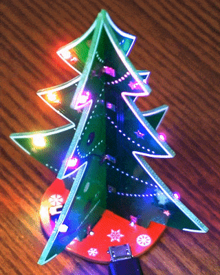

# 3d-xmas-tree

A DIY 3-D christmass tree. ATtiny85 controlls light animation of 12 addressable LEDs. The tree powers from 5v micro USB.

## Ordering PCB

## Part list

## Assembly instructions

## Upload Firmware

